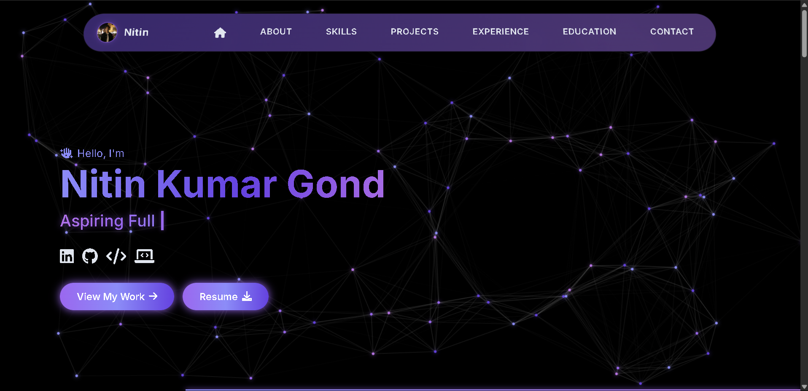

# Nitin Kumar Gond - Developer Portfolio

Welcome to the source code for my personal developer portfolio. This project showcases my skills, projects, and experience in a visually appealing and interactive format. It's designed to be a comprehensive representation of my capabilities as an aspiring software engineer.

**[View Live Demo](https://nitingond1001.github.io/Nitin-s-Portfolio/)** 👈




---

## ✨ Features

-   **Interactive Hero Section:** Features a dynamic typing animation with [Typed.js](https://github.com/mattboldt/typed.js) and a Matrix-style canvas background.
-   **Responsive Design:** Fully responsive layout built with Tailwind CSS, ensuring a great experience on all devices, from mobile phones to desktops.
-   **Animated Skills Showcase:** A continuous, looping slider displays my technical skills, including languages, frameworks, and tools.
-   **Detailed Project Cards:** A dedicated section to showcase my work, with links to live demos and GitHub repositories.
-   **Professional Timelines:** Clean, vertical timelines for both my professional experience and educational background.
-   **Slide-Out Contact Panel:** A sleek, slide-out panel provides quick access to my contact information and social profiles.
-   **Custom Preloader:** A custom loading animation to welcome visitors.
-   **Smooth Scrolling & Navigation:** Easy navigation between sections with a sticky header.

---

## 🛠️ Tech Stack

This portfolio is built with a focus on modern web technologies:

-   **Frontend:** HTML5, CSS3, JavaScript (ES6+)
-   **Styling:** [Tailwind CSS](https://tailwindcss.com/) & Custom CSS for animations and gradients.
-   **Icons:** [Font Awesome](https://fontawesome.com/)
-   **Animations:** [Typed.js](https://github.com/mattboldt/typed.js) for the hero text animation.

---

## 🚀 Getting Started

To run this project locally, follow these simple steps:

1.  **Clone the repository:**
    ```bash
    git clone https://github.com/nitingond1001/Nitin-s-Portfolio.git
    ```

2.  **Navigate to the project directory:**
    ```bash
    cd my-portfolio
    ```

3.  **Open `index.html` in your browser:**
    Since this is a static website with no build steps, you can simply open the `index.html` file directly in your web browser (like Chrome, Firefox, or Edge) to view the portfolio.

---

## 📬 Contact

Feel free to reach out if you'd like to connect or collaborate on a project!

-   **LinkedIn:** [linkedin.com/in/nitingond](https://linkedin.com/in/nitingond)
-   **GitHub:** [@nitingond1001](https://github.com/nitingond1001)
-   **Email:** nitingond.1602@gmail.com

---

*This project was created by Nitin Kumar Gond - [GitHub Profile](https://github.com/nitingond1001)*